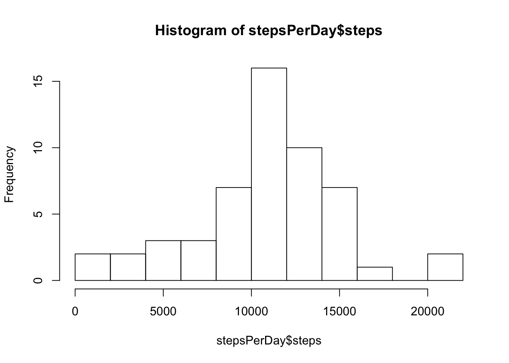
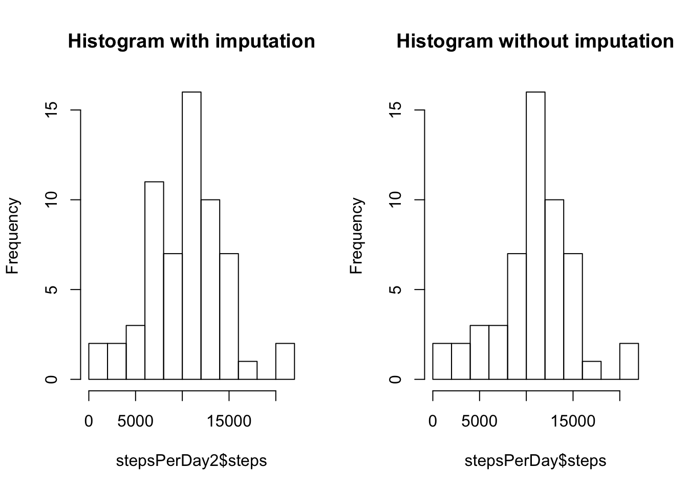
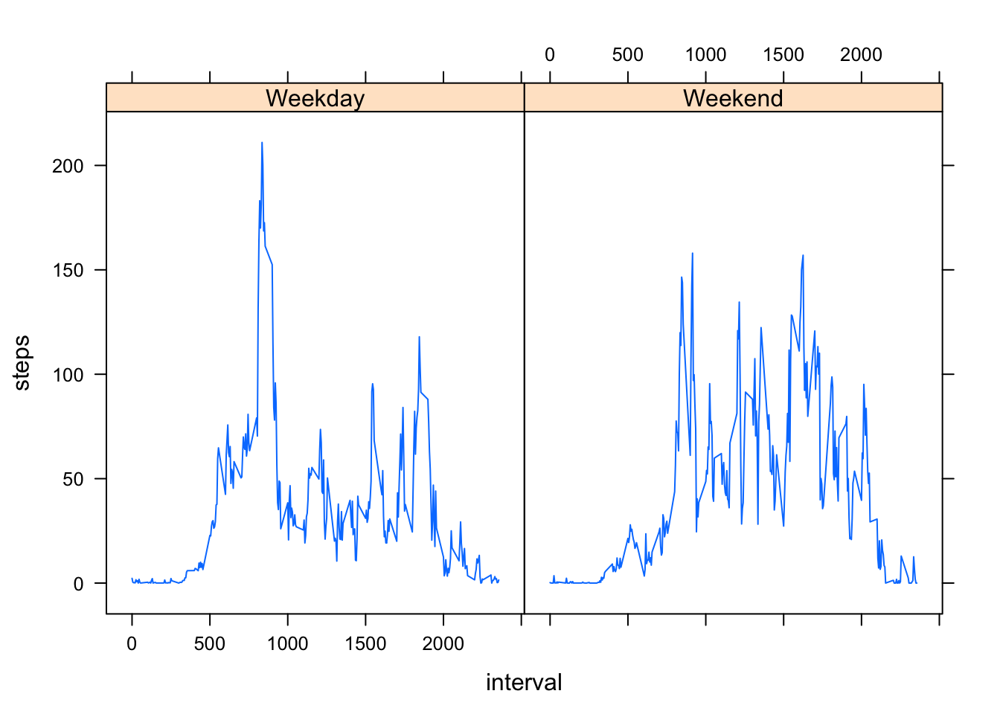

## Activity Monitoring with Step Counts

Step Counts taken over days with 5 minute intervals have been processed. The source of data can be found in the link below. <https://d396qusza40orc.cloudfront.net/repdata%2Fdata%2Factivity.zip>.

With the activity.csv file in the working directory, the file can be read into an object named activity.


```r
activity<-read.csv("activity.csv")
```

## A look at total steps per day

A histogram of total number of steps taken per day can be seen below:


```r
stepsPerDay<-aggregate(data=activity,steps ~ date,FUN=sum)
hist(stepsPerDay$steps,breaks = 10)
```



Note normal distribution of steps, the summary of the data including mean and median is reported:


```r
stepsPerDay<-aggregate(data=activity,steps ~ date,FUN=sum)
summary(stepsPerDay$steps)
```

```
##    Min. 1st Qu.  Median    Mean 3rd Qu.    Max. 
##      41    8841   10760   10770   13290   21190
```
## Average daily activity pattern

A time series plot of the mean number of steps taken vs. the interval is produced.


```r
stepsCombined <- aggregate(data=activity, steps ~ interval, FUN=mean)
with(stepsCombined, plot(interval,steps,type="l"))
```


The maximum activity interval is reported with the code chunk below:

```r
stepsCombined[which.max(stepsCombined$steps),]
```

```
##     interval    steps
## 104      835 206.1698
```

##Imputing missing values in the data set

Due to a large number of missing data, the missing values are imputed by replacing the value for the interval by the respective mean. And as such the imputed value are not integers but floats after imputation. The imputed data set is stored in an object called activity2.


```r
activity2<-activity
activity2[which(is.na(activity$steps)),1]<-apply(activity2[which(is.na(activity$steps)),],1,function(x) x[1]<-stepsCombined[(as.numeric(x[3])/5)+1,2])
```
Two histograms of the average number of steps per day is given before and after imputation.The summaries of the changes are given below


```r
stepsPerDay2<-aggregate(data=activity2,steps ~ date,FUN=sum)
par(mfrow=c(1,2))
hist(stepsPerDay2$steps,breaks = 10,main="Histogram with imputation")
hist(stepsPerDay$steps,breaks = 10,main="Histogram without imputation")
```



```r
summary(stepsPerDay2$steps)
```

```
##    Min. 1st Qu.  Median    Mean 3rd Qu.    Max. 
##      41    7075   10400   10280   12810   21190
```

```r
summary(stepsPerDay$steps)
```

```
##    Min. 1st Qu.  Median    Mean 3rd Qu.    Max. 
##      41    8841   10760   10770   13290   21190
```
#Differences in weekday and weekend activity
The imputed data is given variable weekend with the help of the chron package. This allows us to compare mean activity based on the whether the day of the week is a weekday or not. Two time series plots are given to illustrate the differences.

```r
library(chron)
activity2$weekend = chron::is.weekend(activity2$date)
weekendWeekday<-aggregate(data=activity2,steps ~interval+weekend,FUN=mean)
library(lattice)
weekendWeekday$dotw<-ifelse(weekendWeekday$weekend==1,"Weekend","Weekday")
xyplot(data = weekendWeekday,steps~interval | dotw,type="a")
```



